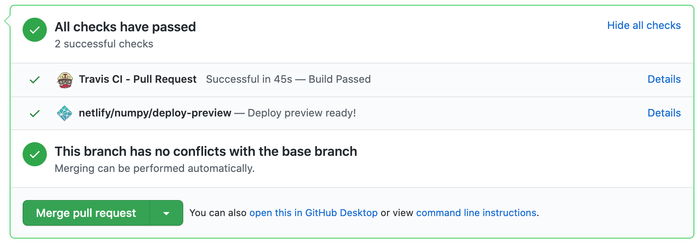

# Numpy.org

[](https://app.netlify.com/sites/numpy/deploys)

## Getting Started

To contribute to the website, you'll first need to install the *extended
version* of Hugo.

The Hugo [install page](https://gohugo.io/getting-started/installing/) has
instructions for different platforms and installers; make sure you end up with
the extended version.

On Linux it may be easiest to pick up a tarball of the latest extended version
from the [release page](https://github.com/gohugoio/hugo/releases/) and
install it per https://gohugo.io/getting-started/installing/#install-hugo-from-tarball.

Next, clone this repository, and install the theme:

```bash
git submodule update --init
```

The development web server is started with:

```bash
make hugo
hugo server
```

or

```bash
make hugo
hugo server -D
```

to run the hugo server with draft enabled.

after which the site should be served at http://localhost:1313.

You'll see

```bash
error: failed to transform resource: TOCSS: failed to transform "style.sass"
```

if you don't have the Hugo extended version.


## User Experience (UX)

### NumPy Color Palette

 `RGB 1/50/67 | HEX #013243`

 `RGB 77/119/207 | HEX #4D77CF`

 `RGB 77/171/207 | HEX #4DABCF`

 `RGB 108/122/137 | HEX #6C7A89`

 `RGB 238/238/238 | HEX #EEEEEE`

 `RGB 255/197/83 | HEX #FFC553`

 `RGB 255/255/255 | HEX #FFFFFF`


## Deployment

Submit pull requests first, those get run on [Netlify](https://quansight-labs.netlify.app/) and you can see a build preview by clicking on the `details` link at the bottom.


